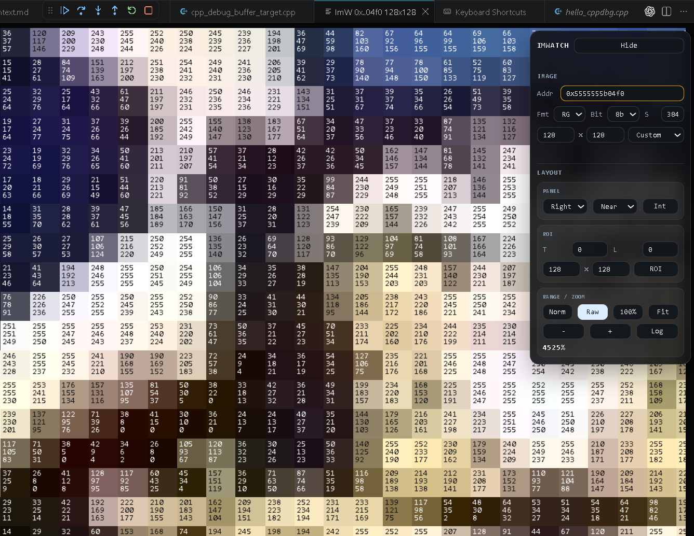

# ImW

Public release repository for the `ImWatch` VS Code extension.

`ImWatch` is a raw image-buffer viewer for VS Code debug sessions. It opens memory-backed image data directly from a stopped debuggee process, shows it as an image, lets you correct raw layout parameters, and helps verify whether a buffer is really `Gray`, `RGB`, `RGBA`, or `YUV420P`.




## What It Can Do

- Open an image buffer from a stopped debug session with one command: `ImWatch: Run`
- Reuse an address already copied to the clipboard
- Fall back to manual `PID + address` input when needed
- Adjust `width`, `height`, `stride`, `format`, and `bit depth`
- Pan and zoom the image, including integer zoom mode
- Switch interpolation filters: nearest, bilinear, cubic, Lanczos, DCTIF
- Auto-detect common raw layout cases for luma and RGB-like buffers
- Copy the internal detection log with the `Log` button for debugging and support

## Install

Download the current VSIX package:

- [imwatch-0.0.3.vsix](https://github.com/gmaxs78/ImW/raw/main/imwatch-0.0.3.vsix)

Install from VS Code:

1. Open `Extensions`
2. Open `...`
3. Choose `Install from VSIX...`
4. Select `imwatch-0.0.3.vsix`

Install from CLI:

```bash
code --install-extension imwatch-0.0.3.vsix
```

## Main Command

- `ImWatch: Run`

Default hotkey:

```text
Ctrl+I, Ctrl+M
```

What happens when you run it:

1. If an active `cppdbg` session exists, ImWatch tries to use it first
2. If the clipboard already contains a usable address or descriptor payload, ImWatch uses it
3. Otherwise it asks for `PID` and then for buffer `Address`

## Typical Workflow

1. Stop the debuggee on a breakpoint
2. Copy the buffer address, for example `0x1f81de00`
3. Run `ImWatch: Run`
4. If the address is valid and memory is readable, the image opens immediately
5. If auto-detect guessed the layout incorrectly, adjust the fields in the inspector

## Inspector

The inspector is a collapsible overlay panel.

How to use it:

- move the mouse to the configured screen edge
- the panel slides in automatically
- double-click the panel to pin or unpin it

Image section:

- `Addr` — raw buffer address
- `Fmt` — `Gray8`, `RGB24`, `RGBA32`, `YUV420P`
- `Bit` — `8`, `10`, `12`, `16`
- `S` — stride in bytes
- `W x H` — width and height
- resolution preset selector with standard names and detected candidates

Layout section:

- inspector position: `right`, `left`, `top`, `bottom`
- interpolation filter selector
- `Int` integer zoom lock
- `Norm` / `Raw` range control
- `100%` and `Fit`
- `Log` copies the current detection/debug text to the clipboard

## Supported Scenarios

- Active `cppdbg/gdb` debug session
- Copied raw address in clipboard
- Manual `PID + address` entry
- Raw memory buffers in Linux processes via `/proc/<pid>/mem` / `ptrace`

## Supported Formats

Current focus is on raw buffers:

- `Gray8`
- `RGB24`
- `RGBA32`
- `YUV420P`

Auto-detection is heuristic. It works well for many practical buffers, but it is still meant as an assistant, not as a guaranteed parser.

## Current Notes

- Primary debug integration target today is `cppdbg/gdb`
- Linux is the main target environment for direct process-memory reading
- The extension can show update notifications by checking a public manifest hosted in this repository

## Update Manifest

This repository also hosts the public update manifest used by the extension:

- [update.json](https://raw.githubusercontent.com/gmaxs78/ImW/main/update.json)

Default manifest URL inside the extension:

```text
https://raw.githubusercontent.com/gmaxs78/ImW/main/update.json
```

## Related Repositories

- Public release repo: [gmaxs78/ImW](https://github.com/gmaxs78/ImW)
- Source repo: [gmaxs78/ImWatch](https://github.com/gmaxs78/ImWatch)
